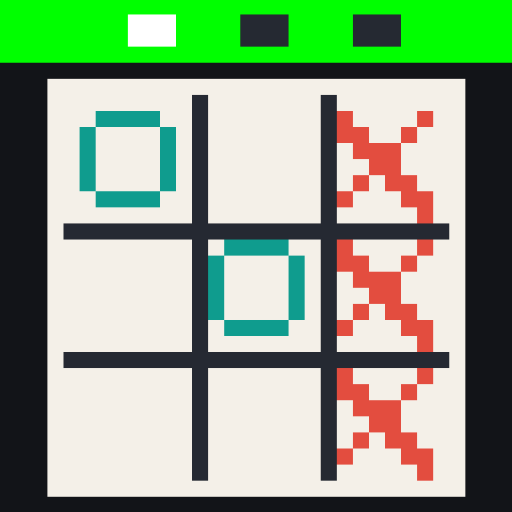

# Jogo da Velha com IA em MIPS Assembly

## Professor

Fernando Ferreira de Carvalho

## Integrantes

- Pedro Gabriel Paes
- Isabelly Ribeiro
- Rubens Sousa
- João Monte

---

## Descrição do Projeto

Este projeto implementa um jogo da velha desenvolvido em **MIPS Assembly** para o simulador **MARS**, utilizando o **Bitmap Display** para exibição gráfica do tabuleiro.

O jogador utiliza a peça **X** e a CPU utiliza a peça **O**, com três níveis de dificuldade diferentes.

---

## Funcionamento da IA

Na fase difícil, a CPU segue a seguinte estratégia:

1. Tenta vencer caso existam duas peças `O` alinhadas e uma casa vazia.
2. Bloqueia o jogador caso existam duas peças `X` alinhadas e uma casa vazia.
3. Prioriza a posição central.
4. Prioriza os cantos.
5. Utiliza as laterais apenas quando não houver outra opção.

---

## Níveis de Dificuldade

### Fase 1 — Fácil

- Centro
- Cantos
- Laterais

### Fase 2 — Médio

- Bloqueia o jogador
- Centro
- Cantos
- Laterais

### Fase 3 — Difícil

- Tenta vencer
- Bloqueia o jogador
- Centro
- Cantos

---

## Estrutura do Projeto

```text
Jogo_Velha_IA
│
├── jogo_velha_ia_mars_bitmap.asm
└── README.md
```

### Arquivo Principal

- `jogo_velha_ia_mars_bitmap.asm` → Implementação do jogo em MIPS Assembly com interface gráfica utilizando Bitmap Display.

---

## Como Executar no MARS

### 1. Abrir o Projeto

- Abra o MARS
- Clique em `File > Open`
- Selecione `jogo_velha_ia_mars_bitmap.asm`

### 2. Configurar o Bitmap Display

Abra:

```text
Tools > Bitmap Display
```

Configure:

```text
Unit Width in Pixels:        16
Unit Height in Pixels:       16
Display Width in Pixels:     512
Display Height in Pixels:    512
Base address for display:    0x10010000 (static data)
```

Clique em:

```text
Connect to MIPS
```

### 3. Executar

- Clique em `Assemble`
- Clique em `Run`

O tabuleiro será exibido no Bitmap Display e as entradas do jogador serão realizadas através das janelas de diálogo do MARS.

---

## Demonstração

Adicione aqui uma captura de tela do jogo:

```md

```

---

## Conceitos Utilizados

- MIPS Assembly
- Estruturas de decisão
- Estruturas de repetição
- Manipulação de memória
- Vetores
- Inteligência Artificial baseada em regras
- Interface gráfica com Bitmap Display
- Verificação de vitória utilizando tabela de combinações

---

## Projeto Acadêmico

Projeto desenvolvido para a disciplina de Arquitetura de Computadores utilizando MIPS Assembly e o simulador MARS.
